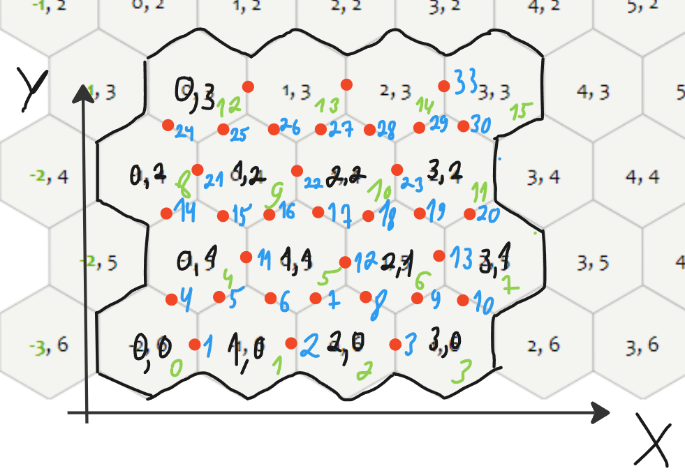

# hexobox_lib - Курсов Михаил
## Задача
Создание контейнера(хранилища) для хранения параметров каждого шестиугольника (часть базового функционала (ядра)):

[Хранилище проекта](https://github.com/nv3033/HexoWorld)
## Схема визуализации данных хранилища

Рис.1 Схема соотношения данных с фактическом расположением объектов сетки в двумерном пространстве (вид сверху)

Зелёное -  номер шестиугольника("гекса") в массиве шестиугольников;

Красное - точки соединения шестиугольников (места переходов);

Синее - номера переходов;

Чёрное - оси координат XOY, координаты гексов в системе XOY;

## Данные
Данные (уточнить, что нужно + как лучше хранить):
- Массив данных каждого гекса:
	- Номер гекса (в массиве)(может быть вычислены из системы координат X, Y);
	- Высота гекса;
	- Тип материал/текстуры поверхности;
	- Список адресов(номеров) всех окружающих гекс переходов (индексы для массива переходов);
	- Список адресов(номеров) вершин (если нужно их хранить)

- Массив данных каждого перехода:
	- Номер перехода (в массиве)(может быть вычислены из системы координат X, Y);
	- Тип материал/текстуры поверхности;
	- Тип сглаживания;
## Реализация
Пример реализации:
- Класс Hexbox:
	- Данные:
		- Массив гексов с типом структуры гексов;
		- Массив переходов с типом структуры переходов;
   		- Массив для временного хранения 4-ёх ближайших гексов относительгно точки на 2д плоскости;
		- Кол-во гексов в массиве гексов;
		- Кол-во переходов в массиве переходов;
		- Ширина и длина сетки (в кол-ве гексах);
	- Функционал класса:
		- Получение данных определённого гекса/перехода;
		- Запись новых данных для определённого гекса/перехода;

## API
- Функции для взаимодействия с классом хранилища:
  	- Получение параметров гекса/перехода;
  	- Изменение параметров гекса/перехода;
  	- Вычисление ближайших четырёх ближайших гексов относительгно точки на 2д плоскости;;
